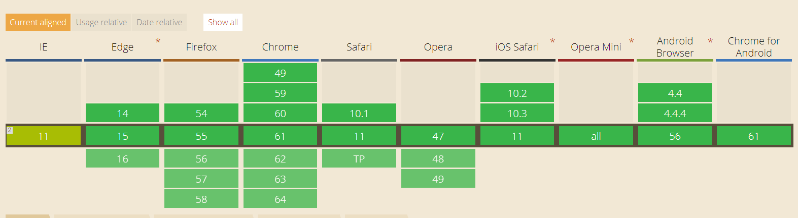
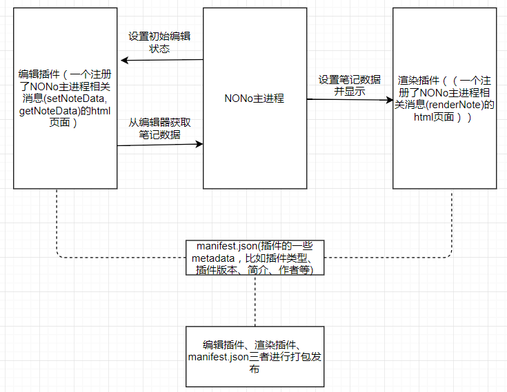
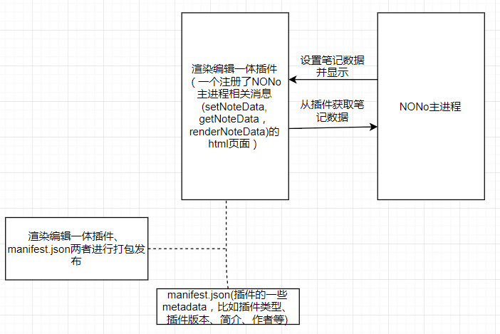

# 什么是NONo笔记编辑器插件

NONo笔记编辑器插件系统基于iframe和Cross-document messaging API实现，各大浏览器对其均有很好的支持

 Cross-document messaging API浏览器支持情况

NONo笔记编辑器插件分为两类：
## 渲染/编辑插件

NONo主程序与渲染/编辑插件的交互示意图

渲染/编辑插件实际上包括两个插件（两个html文件），渲染插件和编辑插件，适合比较重型的编辑任务，比如富文本编辑，Markdown编辑等。笔记保存的时机由NONo主进程自行进行决定。
## 渲染编辑一体插件

NONo主程序与渲染编辑一体插件的交互示意图

渲染编辑一体插件包括一个html文件，承担了渲染和编辑的任务，适合轻量级的编辑任务，比如TodoList，倒计时海报等。笔记保存的时机由插件开发者决定。
