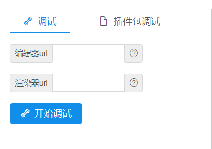
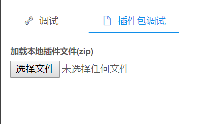
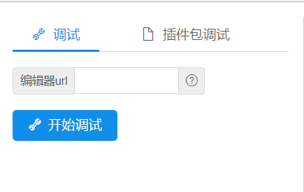
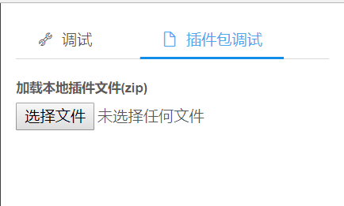

# NONo Plugin SDK
一个用于构建[NONo笔记](http://www.nonobiji.com)编辑器插件的SDK，包括SDK源代码和例子。

>如果你还不知道NONo笔记编辑器插件是什么，请参考[NONo笔记编辑器插件](./what_is_nono_plugin.md)。
# 安装

* 直接引入编译后的脚本

> `    <script     src="http://o8r5rbkhb.bkt.clouddn.com/nono_plugin_sdk/0.0.2/index.js"></script>
`

* NPM

>`npm install nono-plugin-sdk`

# 测试例子
>测试账号与密码 
```
username: test@nonobiji.com

password: 52ziji
```
## [最简单的渲染/编辑插件](./dist/simplestRenderEditorDividedPlugin)
cd到[./dist/simplestRenderEditorDividedPlugin](./dist/simplestRenderEditorDividedPlugin)

` python -m SimpleHTTPServer 9001 `

打开[NONo笔记渲染/编辑插件测试页面](http://www.nonobiji.com/#/plugindebug/dividedRenderEditorPlugin)

### 开发时调试



编辑器Url填入 http://localhost:9001/editor.html

渲染器Url填入 http://localhost:9001/render.html

点击开始调试

### 插件发布前的插件包调试

 

选择[./dist/simplestRenderEditorDividedPlugin/plugin.zip](./dist/simplestRenderEditorDividedPlugin/plugin.zip)即可。


## [最简单的渲染编辑一体插件](./dist/simplestRenderEditorIntegratedPlugin)
cd到[./dist/simplestRenderEditorIntegratedPlugin](./dist/simplestRenderEditorIntegratedPlugin)

` python -m SimpleHTTPServer 9002 `

打开[NONo笔记渲染编辑一体插件测试页面](http://www.nonobiji.com/#/plugindebug/integratedRenderEditorPlugin)

### 开发时调试



编辑器Url填入 http://localhost:9002/plugin.html


点击开始调试

### 插件发布前的插件包调试

 

选择[./dist/simplestRenderEditorIntegratedPlugin/plugin.zip](./dist/simplestRenderEditorIntegratedPlugin/plugin.zip)即可。

# 插件调试

建议先将插件的每个h5页面（渲染/编辑插件包括render.html和editor.html两个入口页面;渲染编辑一体插件包括plugin.html一个入口页面）当作独立的页面进行独立的开发，调试以及测试。

然后，接入nono-plugin-sdk。

最后，在[NONo笔记渲染/编辑插件测试页面](http://www.nonobiji.com/#/plugindebug/dividedRenderEditorPlugin)或[NONo笔记渲染编辑一体插件测试页面](http://www.nonobiji.com/#/plugindebug/integratedRenderEditorPlugin)进行联调。

# 插件打包
NONo笔记插件的最终release形式是*.zip包。
## 渲染/编辑插件打包
将渲染页面和编辑页面首先通过[nono笔记插件资源内联工具](https://github.com/tianyuan168326/nono-plugin-html-inline)将index.html的css,js,img内联，导出为editor.html与render.html的单文件形式，并与manifest.json进行zip打包。

注意，在渲染/编辑插件中，

`"type":"single_note_render_editor_divided_plugin"`
> manifest.json
```json
{
    "type":"single_note_render_editor_divided_plugin",
    "files":{
        "render":"render.html",
        "editor":"editor.html"
    },
    "author":"nonobiji",
    "version":"0.0.1"
}
```

## 渲染编辑一体插件打包
将入口页面首先通过[nono笔记插件资源内联工具](https://github.com/tianyuan168326/nono-plugin-html-inline)将index.html的css,js,img内联，导出为editor.html与render.html的单文件形式，并与manifest.json进行zip打包。

注意，在渲染/编辑插件中，

`"type":"single_note_render_editor_integrated_plugin"`
> manifest.json
```json
{
    "type":"single_note_render_editor_integrated_plugin",
    "files":{
        "editor":"plugin.html"
    },
    "author":"nonobiji",
    "version":"0.0.1"
}
```
# API
API文档请参考[nono-plugin-sdk API文档](./nono-plugin-api-sdk.md)